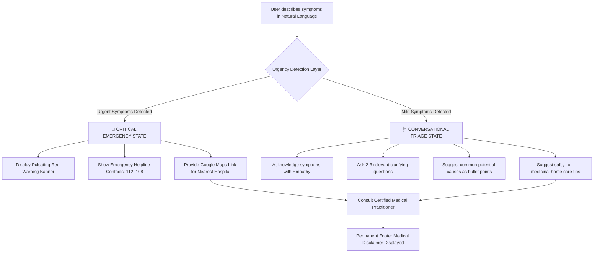

# AI Health Assistant 🩺

> [!TIP]
> ### ⚡ INSTANT TRYOUT - RUNS DIRECTLY IN YOUR BROWSER
> **No setup or command line required!** You can run the application instantly in your web browser with the pre-integrated Gemini API Key:
> 
> 👉 **[Click here to open the Interactive Web App (index.html)](file:///c:/Users/Mr.%20Shrinjoy/Desktop/AI-Health-Assistant/index.html)** 👈
> 
> *(Alternatively, just double-click the `index.html` file in the project folder to open it in your browser.)*

[](https://share.streamlit.io/deploy?repository=https://github.com/Gitersg/AI-Health-Assistant)
[](https://www.python.org/)
[](https://aistudio.google.com/)
[](https://opensource.org/licenses/MIT)

An advanced, responsive, and secure chat-based web application powered by **Streamlit** and the **Google Gemini API** (using `gemini-1.5-flash`). This assistant helps users evaluate their symptoms in natural language, analyzes risk levels, issues emergency warnings when needed, recommends home care for mild issues, and provides trusted resources for professional clinical guidance.

---

## 🚀 One-Click Web Deployment (Streamlit Community Cloud)

You can deploy this application directly to the web for free. Anyone visiting your link will be able to run it!

1. Click the **Deploy to Streamlit** badge at the top of this page.
2. Sign in with your GitHub account.
3. Streamlit will automatically fill in your repository details:
   - **Repository:** `Gitersg/AI-Health-Assistant`
   - **Branch:** `main`
   - **Main file path:** `app.py`
4. Click **Advanced settings...** at the bottom.
5. In the **Secrets** text box, paste your API Key using TOML format:
   ```toml
   GEMINI_API_KEY = "your_actual_gemini_api_key"
   ```
6. Click **Deploy!** Your app will be live and shareable in under a minute.

---

## 🗺️ System Flowchart & Architecture

The following diagram illustrates how the AI Health Assistant processes user inputs, performs triage, evaluates urgency, and displays relevant disclaimers or alerts:



---

## 🌟 Key Features

* **Natural Language Symptom Parsing**: Describe your health concerns naturally (e.g., *"I have a slight headache and a scratchy throat since yesterday"*).
* **Double-Layered Urgency Detection**:
  * **Heuristics Check**: Instant local matching of critical symptom patterns (e.g., chest pain, shortness of breath, slurred speech).
  * **AI Analysis**: Cognitive evaluation of context by the Gemini model to flag emergencies that keyword filters might miss.
* **Urgent Care Redirection**: Immediate triggers that instruct the UI to show flashing red panels, local Indian emergency numbers (**112**, **108**, **102**), and nearby emergency room finders.
* **Empathetic Conversational Triage**: Rather than making immediate assumptions, the AI requests clarifying context (duration, triggers, severity) to align with best medical communication practices.
* **Trusted Global Directories**: Direct integrations with verified national and international medical resources:
  * [World Health Organization (WHO)](https://www.who.int)
  * [Mayo Clinic](https://www.mayoclinic.org)
  * [CDC (Centers for Disease Control)](https://www.cdc.gov)
  * [NHS Health A-Z](https://www.nhs.uk/conditions/)
  * [Ministry of Health & Family Welfare (MoHFW) India](https://www.mohfw.gov.in)
* **Doctor & Hospital Locator**: Quick redirects mapping to Google Maps and Practo to help users find physical consults nearby.
* **Unwavering Disclaimers**: Bold, non-dismissible warning cards and system directives ensuring the user is always aware that the tool is informational and not diagnostic.

---

## 📸 Interface Preview

*(The application utilizes a dark blue-slate aesthetic with glowing teal titles, glassmorphism containers, smooth animations for warning elements, and Streamlit's reactive layout.)*

---

## 🚀 How to Run the Project Locally

Follow these step-by-step instructions to set up and run the project on your machine.

### Prerequisites
* Python 3.8 or higher installed on your system.
* A terminal or command-line interface.

### Step 1: Clone or Navigate to the Directory
Open your terminal and navigate to the project directory:
```bash
cd "C:\Users\Mr. Shrinjoy\Desktop\AI-Health-Assistant"
```

### Step 2: Set Up a Virtual Environment (Recommended)
Create and activate a virtual environment to manage dependencies:
* **Windows**:
  ```powershell
  python -m venv venv
  .\venv\Scripts\Activate.ps1
  ```
* **macOS / Linux**:
  ```bash
  python3 -m venv venv
  source venv/bin/activate
  ```

### Step 3: Install Required Dependencies
Install the required packages using pip:
```bash
pip install -r requirements.txt
```

### Step 4: Configure the Environment Variables
1. Copy the `.env.example` file to create a `.env` file:
   * **Windows (PowerShell)**:
     ```powershell
     Copy-Item .env.example .env
     ```
   * **macOS / Linux / Git Bash**:
     ```bash
     cp .env.example .env
     ```
2. Open the `.env` file and replace `your_gemini_api_key_here` with your actual Google Gemini API key:
   ```env
   GEMINI_API_KEY=your_actual_key_here
   ```

### Step 5: Start the Streamlit Application
Run the Streamlit server:
```bash
streamlit run app.py
```
A new tab should automatically open in your default web browser at `http://localhost:8501`. If it doesn't, copy the URL from the terminal output and paste it into your browser.

---

## 🔑 How to Get a Gemini API Key

1. Go to the [Google AI Studio](https://aistudio.google.com/).
2. Log in using your Google account.
3. Click the **Get API key** button in the top left or center dashboard.
4. Select **Create API key** (either in a new project or an existing one).
5. Copy the generated key and paste it into your `.env` file.

---

## 💡 Future Improvement Ideas

* **Multilingual Support**: Integrate language translation APIs to let users query in Hindi, Bengali, Tamil, Telugu, and other regional languages.
* **Speech-to-Text Input**: Use web speech APIs for direct voice queries to make symptom description easier for impaired individuals.
* **Geolocation Hospital Finder**: Fetch user coordinates to show real-time driving distances to the closest open emergency care centers.
* **SQLite Symptom Tracker**: Store local history of user symptoms to show log entries over time for user reference during medical consults.
